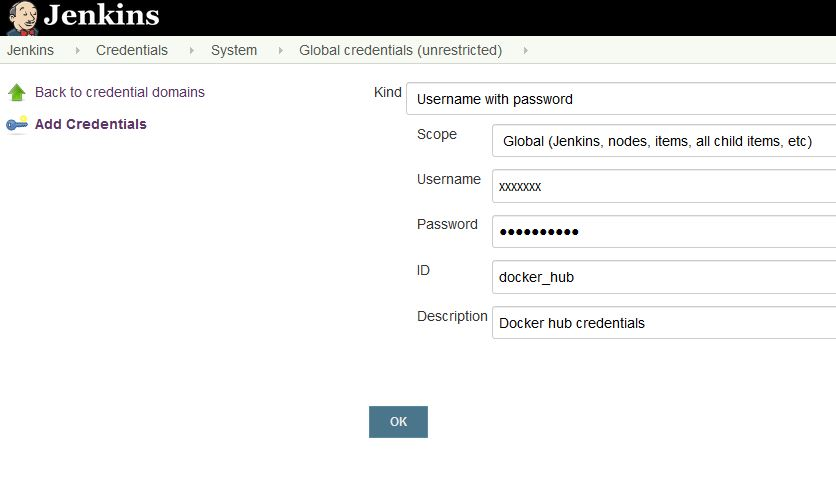
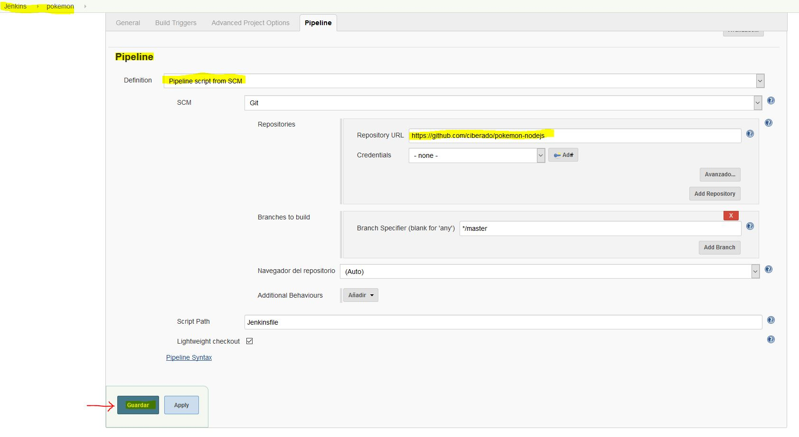

# Jenkins

## Deployment with helm

* Install helm

```bash
helm init
kubectl create serviceaccount --namespace kube-system tiller
kubectl create clusterrolebinding \
    tiller-cluster-rule \
    --clusterrole=cluster-admin \
    --serviceaccount=kube-system:tiller
kubectl patch deploy \
   --namespace kube-system \
   tiller-deploy \
   -p '{"spec":{"template":{"spec":{"serviceAccount":"tiller"}}}}' 
helm repo update
```

* Run jenkins

```bash
helm install stable/jenkins --name jenkins --set rbac.install=true
```

* Get the password

```bash
printf $(kubectl get secret --namespace default jenkins -o jsonpath="{.data.jenkins-admin-password}" | base64 --decode);echo
```

* Check jenkins has cluster credentials

```bash
kubectl get clusterrolebindings | grep jenkins
```

* Open jenkin's UI

```bash
export SERVICE_IP=$(kubectl get svc --namespace default jenkins --template "{{ range (index .status.loadBalancer.ingress 0) }}{{ . }}{{ end }}" )
start http://$SERVICE_IP:8080/login
```

* Login with the username `admin` and the retreived password.

## Prepare the project

* Fork the [pokemon project](https://github.com/ciberado/pokemon-nodejs)
* Edit the [jenkinsfile](https://github.com/ciberado/pokemon-nodejs/blob/master/Jenkinsfile#L28) to replace the name of the repository with your own on [Docker Hub](https://hub.docker.com) 

## Configure job

* Add Docker Hub credentials: go to `/credentials/System/Global credentials/Add Credentials` (**actually, it looks it is not mandatory**)
* Create a new username/password credential named `docker_hub` to identify the job on [Docker Hub](https://hub.docker.com)



* Create a new task named *pokemon* of type *pipeline*
* On *pipeline* configuration select a *definition* of type *Pipeline script from SCM*
* Use your github fork project as *repository url* and click on save



* Go to the just created job and use the *Build now* option (on the left) to run the job

## Clean the house

* Use *Helm* to delete the release

```bash
helm delete --purge jenkins
```
